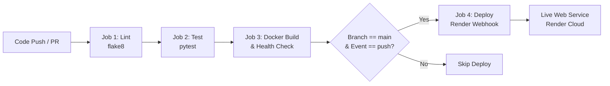

# StudyLog: Study Hours Logger & Subject-wise Progress Tracker

StudyLog is a lightweight web application designed for students to log daily study sessions, track cumulative subject hours, and monitor weekly progress against customizable targets. Built as an individual project submission for **Cloud Computing and DevOps (CCA 2)**, it demonstrates an end-to-end automated DevOps engineering workflow: automated linting, unit testing, container verification, and continuous deployment via Render webhooks.

---

## 🔗 Project Links

- **Live Application URL:** `https://studylog-demo.onrender.com` *(Replace with your Render URL)*
- **GitHub Repository:** `https://github.com/<YOUR_GITHUB_USERNAME>/studylog` *(Replace with your repo URL)*
- **GitHub Actions Runs:** `https://github.com/<YOUR_GITHUB_USERNAME>/studylog/actions`

---

## ✨ Features

- **Session Logging:** Log daily study sessions with subject name, hours studied (0.1–24 hrs), and session date (cannot be in the future).
- **Session History:** Dynamic table displaying all recorded sessions in reverse chronological order (newest first).
- **Subject-Wise Totals:** Aggregated summary table computing all-time study hours per subject.
- **Weekly Progress Tracker:** Set weekly study goals per subject. Visual progress bars track current calendar week (Monday to Sunday) hours against target goals with completion badges.
- **Top Subject Highlight:** Prominently displays the most-studied subject across all logged sessions.
- **Preloaded Demo Data:** Automatically seeds 5 realistic study sessions across 3 subjects and 3 goals on startup; includes a manual "Load Sample Data" reset trigger.
- **Health & API Endpoints:** JSON endpoints (`/api/sessions`, `/api/summary`) and a dedicated `/health` check for uptime monitoring and CI/CD validation.
- **Deployment Version Indicator:** Application footer displays the active 7-character Git commit hash injected automatically by the Render deployment environment.

---

## 🛠️ Tech Stack (100% Free & Open-Source)

- **Language & Framework:** Python 3.12, Flask 3.0+
- **Templating & UI:** Server-side rendered Jinja2 templates, semantic HTML5, modern vanilla CSS (no heavy frontend frameworks)
- **Data Persistence:** Thread-safe in-memory data store (`store.py`) guarded by Python's `threading.Lock`
- **Testing & Quality Assurance:** `pytest` (test client suite) and `flake8` (PEP8 code linting)
- **Production Server:** `gunicorn` (configured with `--workers 1 --threads 4`)
- **Containerization:** Docker (`python:3.12-slim`)
- **Continuous Integration & Delivery:** GitHub Actions (Lint, Test, Docker Build & Health Verification, Render Deploy Webhook)
- **Hosting Platform:** Render Web Service (Free Tier)

---

## 📐 CI/CD Pipeline Architecture

The automated delivery pipeline executes sequentially on every code push and pull request:



### Pipeline Flow:
1. **Lint Job:** Checks code against strict PEP8 standards using `flake8` (max line length 100).
2. **Test Job:** Runs the automated `pytest` suite ensuring all validations and API contracts hold.
3. **Docker Build Job:** Builds container image, launches container in background, and verifies the `/health` endpoint responds with HTTP 200 within 10 retries.
4. **Deploy Job:** Runs **only** when code is pushed to the `main` branch. Sends an authenticated POST request to Render's Deploy Hook (`RENDER_DEPLOY_HOOK`).

---

## 🌐 Routes & API Reference

| Method | Endpoint | Description | Status Code |
| :--- | :--- | :--- | :--- |
| `GET` | `/` | Web dashboard rendering sessions, summary tables, and weekly progress | `200 OK` |
| `POST` | `/sessions` | Validates and adds a study session, then redirects to `/` | `302 Found` / `400 Bad Request` |
| `POST` | `/goals` | Validates and updates weekly goal for a subject, then redirects to `/` | `302 Found` / `400 Bad Request` |
| `POST` | `/seed` | Clears store and reloads sample sessions/goals, then redirects to `/` | `302 Found` |
| `GET` | `/api/sessions`| Returns JSON array of all study sessions (newest first) | `200 OK` |
| `GET` | `/api/summary` | Returns JSON object with aggregated hours per subject | `200 OK` |
| `GET` | `/health` | Health probe returning `{"status": "ok"}` for monitoring & CI | `200 OK` |

---

## 🚀 Local Development Setup

### Prerequisites
- Python 3.12+ installed
- Git installed
- Docker (optional, for container runs)

### 1. Clone & Set Up Virtual Environment

```bash
git clone https://github.com/<YOUR_GITHUB_USERNAME>/studylog.git
cd studylog

# Create virtual environment
python -m venv venv

# Activate virtual environment
# Windows (PowerShell):
.\venv\Scripts\Activate.ps1
# macOS / Linux:
source venv/bin/activate

# Install pinned dependencies
pip install -r requirements.txt
```

### 2. Run Locally

```bash
python app.py
```
Open your browser and navigate to `http://localhost:5000`.

### 3. Run Tests & Linter

```bash
# Run flake8 linter (must produce zero warnings)
flake8 .

# Run pytest test suite
pytest -v
```

---

## 🐳 Running with Docker

### 1. Build Docker Image

```bash
docker build -t studylog .
```

### 2. Run Container

```bash
docker run -d -p 5000:5000 --name studylog-app studylog
```
Access the application at `http://localhost:5000` or test health via `curl http://localhost:5000/health`.

### 3. Stop Container

```bash
docker stop studylog-app && docker rm studylog-app
```

---

## 💡 Key Design Decisions

1. **In-Memory Storage (`store.py`):**
   Storage is implemented entirely in memory using Python standard collections (`list` and `dict`) protected by a `threading.Lock`. This intentional architecture choice keeps the project lightweight, eliminates external database management dependencies, and keeps the assignment focus squarely on the automated CI/CD pipeline, container health verification, and deployment orchestration.
2. **Clean Initial Startup with On-Demand Sample Data:**
   The application starts completely fresh with an empty store (`seed_demo=False`), displaying elegant empty states. A "Load Sample Data" button is available in the UI to populate 5 realistic sample sessions across 3 subjects and 3 goals on demand whenever needed for demonstration.
3. **Single Gunicorn Worker (`--workers 1 --threads 4`):**
   Because application data resides in process memory, running multiple worker processes would cause distinct memory spaces (state desynchronization across HTTP requests). Using exactly one worker with four concurrent threads ensures high concurrency while maintaining shared state.
4. **Database Migration Readiness:**
   In an enterprise production product, `store.py` would be replaced with an ORM interface (such as SQLAlchemy) backed by a managed relational database (such as PostgreSQL), allowing multi-worker scaling.
5. **Keep-Alive Workflow (`keep-alive.yml`):**
   A separate GitHub Actions workflow periodically pings `/health` every 10 minutes to prevent the free-tier Render container from spinning down due to inactivity. This workflow is kept completely isolated from `ci-cd.yml` so delivery pipeline history remains clean. *This file is optional and can be safely deleted if not required.*
